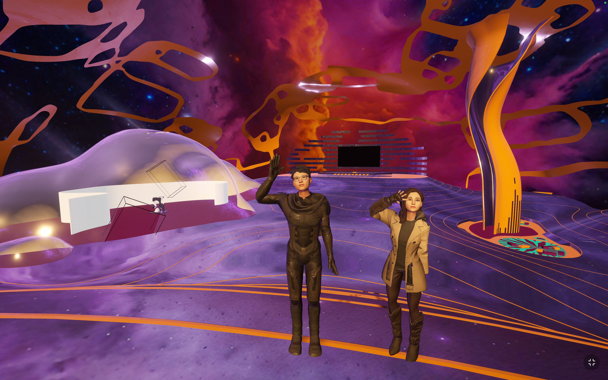
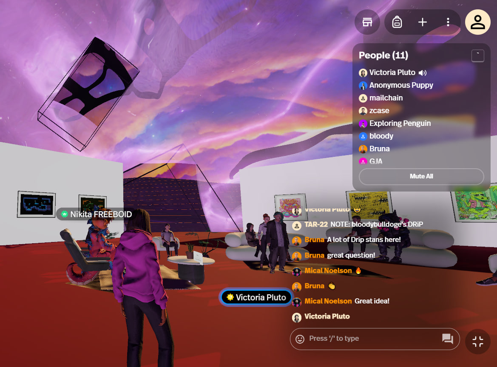

# 🌆 Events & Exhibitions

## Superstage at Prachtwerk, Neukölln, Berlin

IRL EVENT COMING OCT 16, 2024

## Solana ST Pavilion x Creative Scene

<figure><figcaption></figcaption></figure>

**On May 20th, 2024, Solana Superteams hosted an inspirational hour of creativity and inspiration at their Show & Tell event in the digital Solana Superteams Pavilion on Spatial.**

A call went out to all Solana Superteam members to participate, showcasing their mind-blowing projects, interesting insights, or unique stories. The event focused on the creative scene of Solana, welcoming artists, collectors, DAOs, and anyone with a project they were passionate about. It offered a chance to "shine bright like a supernova" and gain valuable insights from the Solana ecosystem experts.

The event provided a platform for passionate creators to share their work and soak in inspiration. Additionally, it offered an opportunity to receive feedback and elevate projects with the help of bright minds from across the globe. The message was clear: don't miss this golden opportunity to connect, collaborate, and gain boundless inspiration.

**This Show & Tell event marked the beginning of a journey for the Metaverse Solana Superteams Pavilion.** Attendees were promised a whirlwind of concerts, enlightening talks, immersive workshops, and an awe-inspiring exhibition showcasing the diverse talents of Solana Superteams artists.

Unfortunately, the event has already passed, but hopefully, the information about the future plans for the Metaverse Solana Superteams Pavilion is still exciting!

## NEXUS at Solana Pavilion

<figure><figcaption></figcaption></figure>
