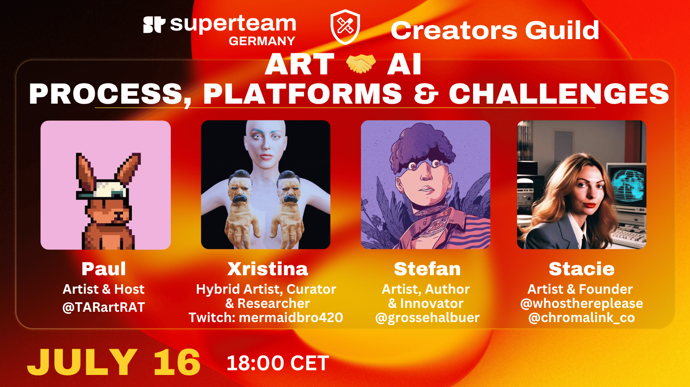
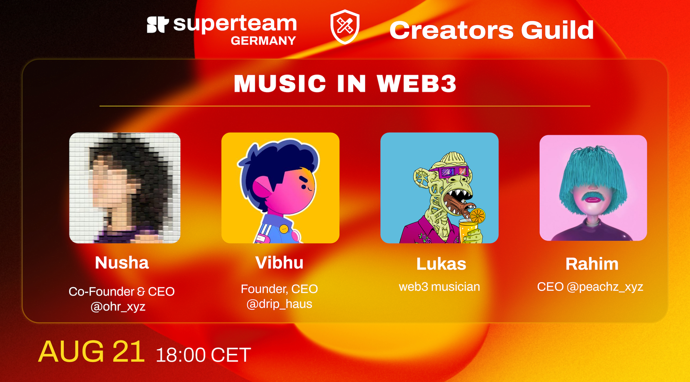
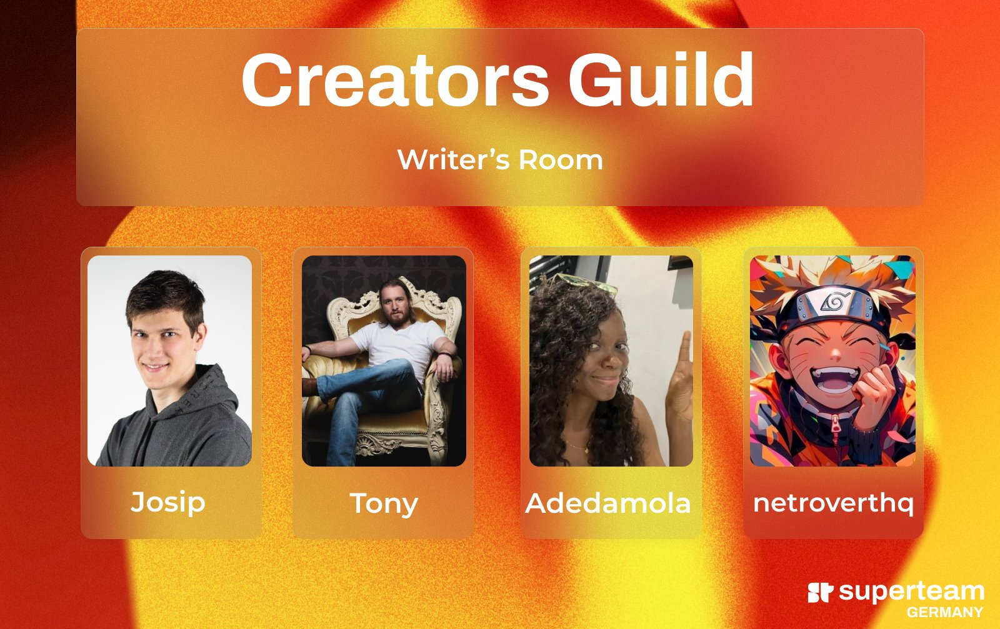

# 🔮 CREATORS GUILD powered by Solana Superteam Germany

<figure><figcaption><p>Spaces live on x/Twitter.</p></figcaption></figure>

```
https://youtube.com/playlist?list=PLeszzWXLYEN0YerAHhn7JAUXzPXIE6BIl&si=EulY3YL648lB1EOV


```

## CREATORS GUILD GUESTS have included:

Stefan Große Halbuer - Artist, Author & Innovator @grossehalbuer&#x20;

Stacie Ant - Digital Artist @whosthereplease & Founder @chromalink\_co

Xristina Sarli - Hybrid Artist, Curator & Researcher mermaidbro420 (twitch)

Thomukas @thomukas1 of Rubians.lol @RubiansVR & @BigDiggas

Multitalented Zoë @ZoeCatherineF - Founder of @cryptogirlsclub organizing global events for @joinwebzero.&#x20;

Musician-turned-CPO Robert Stanley aka @DJBobbyStarrr of @UnifyGiving & European Artist Bank

Prof. Francisco "Franc" Guerrero,&#x20;

Berlin-based art Curator Anna Poubova,&#x20;

Web3 Multitalent Travi,&#x20;

Creative-Founder Meylen & Host Paul of SuperteamDE


CREATORS GUILD v23: CREATE & RELEASE&#x20;

feat. Artists & Co-Curators of @SOL\_Animate Animation Festival Trev & Steve, Digital Artist

Innovator Gert-Jan @GertJanAkerboom, Comic Creator & Storyteller Roach @RoachWrites\_



[https://x.com/i/broadcasts/1mrxmBLWVVNKy](https://x.com/i/broadcasts/1mrxmBLWVVNKy)<br>



CREATORS GUILD: ART + AI (PART 2) - Process, Platforms & Challenges&#x20;

feat. SPEAKERS:&#x20;

Xristina Sarli - Hybrid Artist, Curator & Researcher&#x20;

Stefan Große Halbuer - Artist, Author & Innovator [@grossehalbuer](https://x.com/grossehalbuer)

Stacie Ant - Digital Artist[@whosthereplease](https://x.com/whosthereplease)& Founder[@chromalink\_co](https://x.com/chromalink_co)&#x20;

\
[https://x.com/SuperteamDE/status/1945182445839769769?s=20](https://x.com/SuperteamDE/status/1945182445839769769?s=20)

ART + AI - CREATORS' JOURNEY (PART 1)...

CREATORS GUILD : [https://www.youtube.com/watch?v=qz2ltEO7N7o](https://www.youtube.com/watch?v=qz2ltEO7N7o)

<figure><figcaption></figcaption></figure>



<figure><figcaption></figcaption></figure>

<figure><figcaption><p>Oct. 2, 2024: WHY WEB3 ART?</p></figcaption></figure>


<details>

<summary>CREATORS GUILD v9: WHY WEB3 ART?</summary>

CREATORS GUILD v9: WHY WEB3 ART?&#x20;

will featuring a super lineup of special guests:

Painter & Professor Francisco Guerrero [@elvisbanana](https://x.com/elvisbanana)

NFT Biennial Founder & Director Rahum Unlu [@rahim\_unlu](https://x.com/rahim_unlu)

Artist Silvia Anan [@sakehqueen](https://x.com/sakehqueen) &

Artist REZ [@Rez\_inProgress](https://x.com/Rez_inProgress)

📅 OCT 2nd

⏰ 18:00 CEST (UTC + 2)

📍 [https://x.com/i/spaces/1mnxeAkWYLnxX/peek](https://x.com/i/spaces/1mnxeAkWYLnxX/peek)

</details>

<details>

<summary>CREATORS GUILD v8: ROUNDTABLE, ROUNDUP &#x26; RESOURCES! (Breakpoint FOMO Edition;)</summary>

CREATORS GUILD v8: ROUNDTABLE, ROUNDUP & RESOURCES! For this epic edition of CREATORS GUILD we will have a roundtable discussion while revisiting everything that has developed this year from our guests' alpha AND finally launch the fabled GitHub resource library which has been in the works! Got Breakpoint FOMO? Join us as we share insights in a genuine roundtable edition (all the while pretending our frens aren't all having fun in Singapore without us;)&#x20;

LINK: [https://x.com/i/spaces/1RDGlyONpokJL](https://x.com/i/spaces/1RDGlyONpokJL)

</details>

<figure><figcaption></figcaption></figure>

<details>

<summary>CREATORS GUILD v7: ON EDITIONS</summary>

LISTEN: insert link

TAKEAWAYS:


</details>

<figure><figcaption></figcaption></figure>

<details>

<summary>CREATORS GUILD v6: Music in Web3</summary>

LISTEN: [https://x.com/i/spaces/1YpJklPPlPNxj](https://x.com/i/spaces/1YpJklPPlPNxj)

</details>

<details>

<summary>CREATORS GUILD v5:</summary>

Creators Guild: Web3 security, safety and scams #web3 [https://x.com/i/spaces/1OyJAZmWEyNxb](https://x.com/i/spaces/1OyJAZmWEyNxb)

</details>

<figure><figcaption></figcaption></figure>

<details>

<summary>CREATORS GUILD v4: Writer's Room<br><br><a href="https://x.com/i/spaces/1kvKpbPdbkmJE">https://x.com/i/spaces/1kvKpbPdbkmJE</a> </summary>

[@JosipVolarevic2](https://x.com/JosipVolarevic2) Founder of [@dReaderApp](https://x.com/dReaderApp)[@tonyboyletweets](https://x.com/tonyboyletweets) Community Dev [@metaplex](https://x.com/metaplex)[@Adedamolajoke](https://x.com/Adedamolajoke) & [@netrovertHQ](https://x.com/netrovertHQ) leading creator & writer initiatives [@SuperteamNG](https://x.com/SuperteamNG)

680 people tuned in at last count - thanks everyone!&#x20;

[https://x.com/SuperteamDE/status/1815713989596422325](https://x.com/SuperteamDE/status/1815713989596422325)<br>

</details>

<details>

<summary>Creators Guild v3: BONK ART MASTERS Program with JT Liss </summary>

[https://x.com/i/spaces/1mrGmyBLRBBGy](https://x.com/i/spaces/1mrGmyBLRBBGy)

</details>

<details>

<summary>v2</summary>


</details>

<details>

<summary>Solana Superteam Solana Pavilion</summary>

**On May 20th, 2024, Solana Superteams hosted an inspirational hour of creativity and inspiration at their Show & Tell event in the digital Solana Superteams Pavilion on Spatial.**

A call went out to all Solana Superteam members to participate, showcasing their mind-blowing projects, interesting insights, or unique stories. The event focused on the creative scene of Solana, welcoming artists, collectors, DAOs, and anyone with a project they were passionate about. It offered a chance to "shine bright like a supernova" and gain valuable insights from the Solana ecosystem experts.

The event provided a platform for passionate creators to share their work and soak in inspiration. Additionally, it offered an opportunity to receive feedback and elevate projects with the help of bright minds from across the globe. The message was clear: don't miss this golden opportunity to connect, collaborate, and gain boundless inspiration.

**This Show & Tell event marked the beginning of a journey for the Metaverse Solana Superteams Pavilion.** Attendees were promised a whirlwind of concerts, enlightening talks, immersive workshops, and an awe-inspiring exhibition showcasing the diverse talents of Solana Superteams artists.

Unfortunately, the event has already passed, but hopefully, the information about the future plans for the Metaverse Solana Superteams Pavilion is still exciting!

LINKS: [https://www.spatial.io/s/Solana-Pavilion-66439d1d820e8f5b14026d25?share=2220362865115262330](https://www.spatial.io/s/Solana-Pavilion-66439d1d820e8f5b14026d25?share=2220362865115262330)

[https://x.com/solanapavilion](https://x.com/solanapavilion)&#x20;


</details>

<figure><figcaption></figcaption></figure>

Some of our early Creator meetings and exhibitions happened in the Superteams [Solana Pavilion](https://www.spatial.io/s/Solana-Pavilion-66439d1d820e8f5b14026d25?share=2220362865115262330) - please see Events & Exhibitions section for more details.&#x20;

<details>

<summary>v0</summary>


</details>

## ROUNDTABLE IRLs
