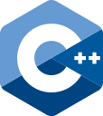

# ⚡ Backend

## TypeScript

Thanks to Turbin3's transpiler Poseiden, you can now write smart contracts in [Typescript](https://www.moodle.tum.de/login/index.php?loginredirect=1).



## Rust&#x20;

[Rust](https://github.com/anza-xyz/agave/wiki/Learning-Rust) is the primarily programming language used to develop Programs on Solana. [Native Rust ](https://solana.com/docs/programs/rust)refers to writing Solana programs without using frameworks like [Anchor](https://www.alchemy.com/overviews/solana-anchor). This approach provides developers with direct control over their Solana programs. However, it requires more manual setup and boilerplate code compared to using the Anchor.

### :anchor:Anchor 

If you decide to go the rust way, it is recommended to start your journey with the Anchor framework.&#x20;

Anchor can help you write safe programs because it includes lots of checks that you would have to implement manually.



## Seahorse (Python)

There are also various community driven efforts to enable writing on-chain programs using other languages, including Python  via [Seahorse](https://seahorse.dev/) (that acts as a wrapper the Rust based [Anchor framework](backend.md#example-programs))



##  C/C++ 

Although very limited, you can still build abstract Solana programs.&#x20;



## Example programs [#](https://solana.com/docs/programs/overview#example-programs) 

You can also explore the [Program Examples](https://solana.com/docs/programs/examples) for examples of on-chain programs.

