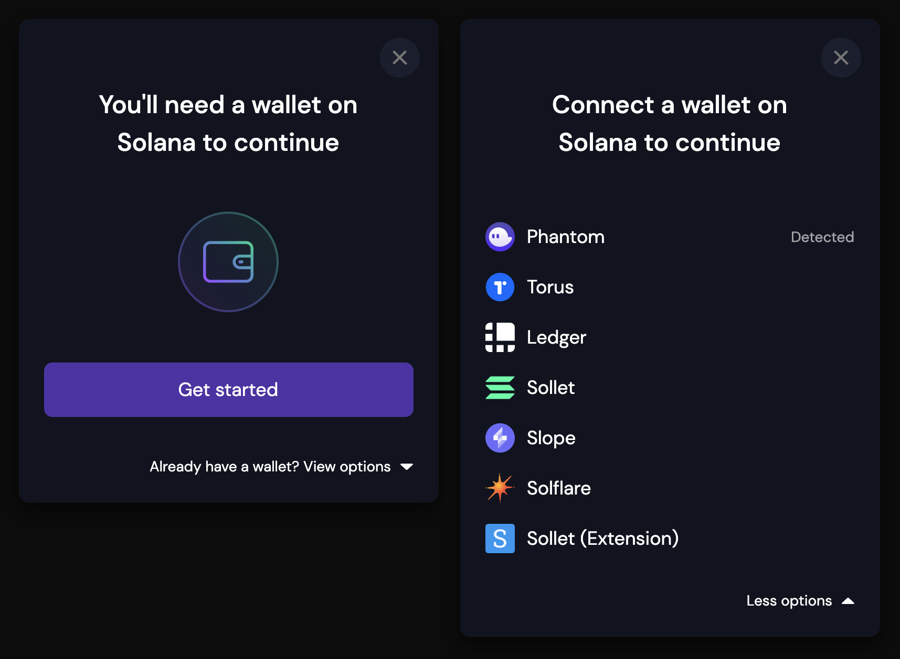

# Wallet Integration

### Solana Wallet Adapter

If you build web apps, and need users to be able to connect to their wallets and sign transactions through your apps, you'll want[ Solana's Wallet Adapter](https://solana.com/developers/courses/intro-to-solana/interact-with-wallets#solana-s-wallet-adapter).

<figure><figcaption></figcaption></figure>

For real-life examples of using the Wallet Adapter in your React based web and mobile applications, check out this [directory](https://github.com/anza-xyz/wallet-adapter).

### Unified Wallet Kit

[Unified Wallet Kit](https://unified.jup.ag/) is an open source easy-to-integrate Wallet Adapter, that is built on top of Solana's Wallet Adapter. Here are code examples:



### TipLink

TipLink is an easy-to-use, non-custodial wallet that makes transferring funds as simple as sharing a link. Think of it as pre-paid gift cards, except that the gift cards are actual wallets that the user has full control over.&#x20;



### Social Logins

Many other wallet managers like [dynamic.xyz](https://www.dynamic.xyz/), [Magic Link](https://magic.link/docs/home/welcome), and [Web3Auth](https://web3auth.io/) offer social-embedded (Email, Google, Apple etc.) wallet creation as well as via SSO.

