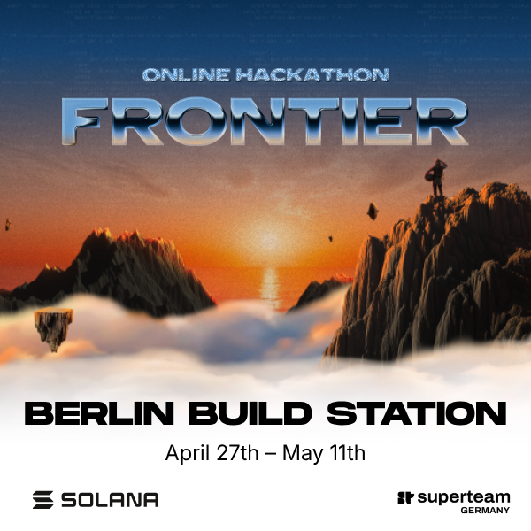

# 🛠️ Build Station

<figure><figcaption></figcaption></figure>

Build Station is Superteam Germany’s builder base for Colosseum Frontier, the biggest crypto hackathon.

It is designed for teams and solo builders who want real momentum, not just a registration link. The format combines IRL coworking with mentorship, DevRel support, workshops, accountability, and pitch preparation around the Colosseum cycle.

For the current cycle shown on the Superteam Germany website:

- Frontier hackathon: April 6, 2026 to May 11, 2026
- Build Station: April 27, 2026 to May 11, 2026
- Berlin Demo Day: May 12, 2026

## What To Expect

- focused time to build with other serious teams
- mentorship and product feedback
- DevRel and marketing support
- workshops and practical builder sessions
- demo-day style momentum toward submission

## Best For

- teams building for Colosseum Frontier
- solo builders who want structure and community
- early founders validating an idea while shipping
- people who learn faster in a shared environment

## Key Links

- [Register for Build Station](https://lu.ma/buildstation)
- [Register for the Hackathon](https://arena.colosseum.org/?ref=germany)
- [Berlin Demo Day](https://lu.ma/berlindemoday)
- [Superteam Germany Hackathon Guide](https://superteamdao.notion.site/colosseum-hackathon-2025)
- [Book 1:1 Mentoring](https://superteamdao.notion.site/colosseum-hackathon-2025#1e8794d3ba3380a7bfe1d2428dd4db04)
- [Build Station Website Page](https://de.superteam.fun/buildstation)



For everything around submissions, team formation, and Colosseum-specific preparation, continue to the [Hackathon Hub](../hackathon-hub/README.md).
